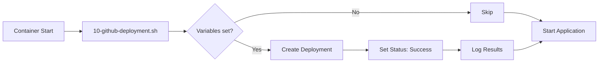

# GitHub Deployments Integration - Quick Start

## 📦 Was wurde implementiert?

Ein automatisches System, das beim Container-Start den GitHub Deployment-Status aktualisiert.

## 🔧 Änderungen

### 1. Neues Entrypoint-Script
- **Datei**: `docker/entrypoint.d/10-github-deployment.sh`
- **Funktion**: Erstellt GitHub Deployments und setzt Status auf "success"
- **Fail-Safe**: Blockiert niemals den Container-Start

### 2. Dockerfile-Anpassung
- **Änderung**: Installation von `curl` für GitHub API calls
- **Zeilen**: 45-52 in `Dockerfile`

### 3. Dokumentation
- **Datei**: `docker/GITHUB-DEPLOYMENTS.md`
- **Inhalt**: Vollständige Setup-Anleitung für Coolify

## ⚡ Schnellstart

### Schritt 1: GitHub Token erstellen
```
GitHub → Settings → Developer settings → Personal access tokens
Scope: ✅ repo
```

### Schritt 2: Coolify Environment Variables
```bash
GITHUB_TOKEN=ghp_your_token_here          # Als Secret markieren!
GITHUB_REPO=username/repository
GITHUB_REF=main                           # Optional, Standard: main
DEPLOYMENT_ENVIRONMENT=production         # Optional, Standard: production
APP_URL=https://your-app.com             # Optional, meist schon gesetzt
```

### Schritt 3: Deploy
```bash
# Coolify macht das automatisch beim nächsten Deployment
# Oder manuell:
git push origin main
```

### Schritt 4: Verifizieren
1. Schaue in Coolify-Logs nach:
   ```
   ✅ Deployment created with ID: xxxxx
   ✅ Deployment status updated to success
   ```

2. Prüfe GitHub:
   ```
   Repository → Environments Tab
   ```

## 🎯 Features

- ✅ Fail-safe: Startet Container auch bei API-Fehlern
- ✅ 10s Timeout für API-Calls
- ✅ Ausführliches Logging
- ✅ Unterstützung für mehrere Environments
- ✅ Kein manueller Eingriff nötig
- ✅ Kompatibel mit bestehenden Entrypoint-Scripts
- ✅ **NEU**: GitHub API 2022-11-28 konform mit `log_url`, `production_environment`, `transient_environment`
- ✅ **NEU**: Automatische Erkennung ob Production oder Staging
- ✅ **NEU**: Explizite Deaktivierung alter Deployments für Production

## 📊 Workflow



## 🔍 Debugging

Logs in Coolify prüfen:
```bash
# Erfolg:
Starting GitHub Deployment status update...
✅ Deployment created with ID: 123456789
✅ Deployment status updated to success

# Skipped (kein Token):
⚠️  GitHub Deployment update skipped: GITHUB_TOKEN or GITHUB_REPO not set

# API-Fehler (blockiert nicht):
⚠️  Failed to create deployment (API might be rate-limited)
```

## 📚 Dokumentation

Vollständige Anleitung: `docker/GITHUB-DEPLOYMENTS.md`

## 🔐 Security

- Token als **Secret** in Coolify markieren
- Minimale Permissions (nur `repo`)
- Token nicht im Code committen
- Regelmäßig rotieren

---

**Ready to deploy! 🚀**

Beim nächsten Coolify-Deployment wird die Integration automatisch aktiv.
